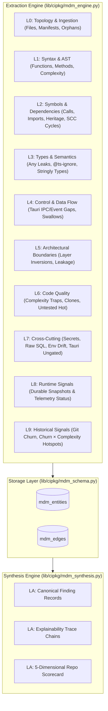

# 📘 CIP Master Data Model (L0–LA) Implementation Guide

## Executive Summary & Architectural Overview

The **Code Intelligence Platform (CIP)** has been upgraded with a comprehensive, layered **Master Data Model (MDM)** taxonomy spanning **Layers L0 through LA**.

This architecture turns CIP into a layered, queryable, explainable code forensics engine. Every reportable risk at Layer LA is corroborated with a deterministic **Explainability Trace** linking back to lower-layer ground-truth evidence across topology, syntax, symbols, control flow, architectural boundaries, code smells, cross-cutting security patterns, and temporal commit churn.

---

## 1. The 11-Layer Master Data Hierarchy (L0–LA)

```
┌────────────────────────────────────────────────────────────────────────────────────────┐
│                               MASTER DATA TAXONOMY (L0–LA)                             │
├────┬───────────────────────────┬───────────────────────────────────────────────────────┤
│ L0 │ Topology & Ingestion      │ Files, Manifests, Workspaces, Build Maps, Orphan Files│
├────┼───────────────────────────┼───────────────────────────────────────────────────────┤
│ L1 │ Syntax & Parse            │ AST nodes, Function/Method/Type/Doc defs, Failures    │
├────┼───────────────────────────┼───────────────────────────────────────────────────────┤
│ L2 │ Symbol & Dep Graph        │ FQN symbols, Call/Import/Heritage edges, Tarjan SCC   │
├────┼───────────────────────────┼───────────────────────────────────────────────────────┤
│ L3 │ Type & Semantic Layer     │ Inferred types, `any` leaks, Nullable paths, Enums    │
├────┼───────────────────────────┼───────────────────────────────────────────────────────┤
│ L4 │ Control & Data Flow       │ CFG branches, Tauri IPC/Event wiring gaps, Swallows   │
├────┼───────────────────────────┼───────────────────────────────────────────────────────┤
│ L5 │ Architectural Boundaries  │ Layer violations (lib->ui), Adapter drift, Leakages   │
├────┼───────────────────────────┼───────────────────────────────────────────────────────┤
│ L6 │ Code Quality & Smells     │ Complexity traps, Duplications, Untested hot symbols  │
├────┼───────────────────────────┼───────────────────────────────────────────────────────┤
│ L7 │ Cross-Cutting Concerns    │ Hardcoded secrets, Raw SQL, Env drift, Tauri ungated  │
├────┼───────────────────────────┼───────────────────────────────────────────────────────┤
│ L8 │ Runtime & Operational     │ Snapshots, Panics/Crashes, Feature flag verification  │
├────┼───────────────────────────┼───────────────────────────────────────────────────────┤
│ L9 │ Historical & Evolutionary │ Git commit churn, Churn × Complexity hotspots, Drift  │
├────┼───────────────────────────┼───────────────────────────────────────────────────────┤
│ LA │ Governance & Synthesis    │ Finding Records + EXPLAINABILITY TRACES, Debt Index   │
└────┴───────────────────────────┴───────────────────────────────────────────────────────┘
```

---

## 2. Database Schema & Architecture (`lib/cipkg/mdm_schema.py`)

The SQLite database (`index.db`) has been upgraded to **`SCHEMA_VERSION = 5`** with 4 dedicated tables:

### 1. `mdm_entities`
Stores all ground-truth facts extracted across L0–L9.
```sql
CREATE TABLE IF NOT EXISTS mdm_entities (
    id TEXT PRIMARY KEY,
    layer TEXT NOT NULL,
    kind TEXT NOT NULL,
    path TEXT NOT NULL,
    start_line INTEGER DEFAULT 0,
    end_line INTEGER DEFAULT 0,
    name TEXT NOT NULL,
    attributes_json TEXT,
    created_at REAL NOT NULL
);
CREATE INDEX idx_mdm_ent_layer ON mdm_entities(layer);
CREATE INDEX idx_mdm_ent_kind ON mdm_entities(kind);
CREATE INDEX idx_mdm_ent_path ON mdm_entities(path);
```

### 2. `mdm_edges`
Stores relationships between entities across layers.
```sql
CREATE TABLE IF NOT EXISTS mdm_edges (
    src TEXT NOT NULL,
    dst TEXT NOT NULL,
    kind TEXT NOT NULL,
    layer TEXT NOT NULL,
    attributes_json TEXT,
    PRIMARY KEY (src, dst, kind)
);
CREATE INDEX idx_mdm_edge_src ON mdm_edges(src);
CREATE INDEX idx_mdm_edge_dst ON mdm_edges(dst);
CREATE INDEX idx_mdm_edge_layer ON mdm_edges(layer);
```

### 3. `mdm_findings`
Stores canonical Layer LA prioritized finding records.
```sql
CREATE TABLE IF NOT EXISTS mdm_findings (
    finding_id TEXT PRIMARY KEY,
    layer_origin TEXT NOT NULL,
    rule_id TEXT NOT NULL,
    severity TEXT NOT NULL,
    confidence TEXT NOT NULL,
    path TEXT NOT NULL,
    line INTEGER DEFAULT 0,
    symbol_id TEXT,
    title TEXT NOT NULL,
    detail TEXT,
    suggestion TEXT,
    effort TEXT DEFAULT 'small',
    score REAL DEFAULT 0.0,
    created_at REAL NOT NULL
);
CREATE INDEX idx_mdm_find_sev ON mdm_findings(severity);
CREATE INDEX idx_mdm_find_rule ON mdm_findings(rule_id);
```

### 4. `mdm_traces`
Enforces explainability by recording the exact multi-layer evidence chain for each finding.
```sql
CREATE TABLE IF NOT EXISTS mdm_traces (
    finding_id TEXT NOT NULL,
    step_index INTEGER NOT NULL,
    layer TEXT NOT NULL,
    entity_id TEXT NOT NULL,
    evidence_description TEXT NOT NULL,
    PRIMARY KEY (finding_id, step_index)
);
CREATE INDEX idx_mdm_trace_fid ON mdm_traces(finding_id);
```

---

## 3. The Extraction & Synthesis Pipeline



---

## 4. CLI Commands & Usage Reference

### 1. Execute Full Multi-Layer Scan
Extracts all L0–L9 entities and synthesizes LA findings:
```powershell
python -m cipkg.cli mdm-scan
```

### 2. Generate Executive Dossier & Scorecard
Generate human-facing reports in formatted terminal output or Markdown:
```powershell
# Formatted JSON output
python -m cipkg.cli mdm-report

# Export clean GitHub Flavored Markdown
python -m cipkg.cli mdm-report --markdown > REPORT.md
```

### 3. Inspect Silent Wiring Gaps
Focus specifically on disconnected Tauri IPC commands, event emitters, and unlistened channels:
```powershell
python -m cipkg.cli mdm-gaps
```

### 4. Trace Finding Explainability
Display the exact step-by-step evidence chain behind any finding:
```powershell
python -m cipkg.cli mdm-trace LA-GAP-non_existent_command-ui.ts
```

---

## 5. MCP Tool Surface for AI Agents

The MCP Server (`lib/cipkg/server.py`) exposes the following native tools:

| MCP Tool | Description | Parameters |
| :--- | :--- | :--- |
| `mdm_scan` | Runs full L0–LA extraction and synthesis pass | None |
| `mdm_report` | Returns the 5-dimensional scorecard and prioritized findings | `{"markdown": boolean}` |
| `mdm_gaps` | Returns list of detected silent IPC/event wiring gaps | None |
| `mdm_trace` | Fetches the full multi-layer evidence path for a finding | `{"finding_id": string}` |

---

## 6. Performance & Scaling Guidelines

1. **In-Memory Sorting & Cache**: SQLite temp stores run in `MEMORY` with a 64MB page cache (`PRAGMA cache_size=-65536`) and WAL mode.
2. **Bulk Batching**: All entity and edge writes use parameterized bulk batches (`executemany`) to avoid statement overhead.
3. **120K Token Safety**: The `mdm_trace` tool returns targeted 4-to-5 step evidence chains rather than dumping entire source files, keeping context consumption under 250 tokens per finding.
