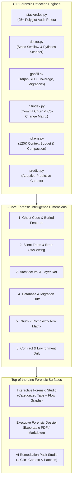

# CIP Code Forensics, Deep Intelligence & UX Master Blueprint

**Date:** 2026-08-21  
**Scope:** Core Engine ([`lib/cipkg/`](file:///c:/0-BlackBoxProject-0/index/lib/cipkg/)) · Web Console ([`web/`](file:///c:/0-BlackBoxProject-0/index/web/)) · Forensic Analysis & Reporting  
**Status:** Canonical Design & Implementation Blueprint  

---

## 1. Executive Summary & The Core Mission

The primary raison d'être of the **Code Intelligence Platform (CIP)** is **code forensics, architectural investigation, and hidden intelligence discovery**. It is designed to act as an automated architectural x-ray machine for polyglot codebases.

### The Ground-Truth Discovery Gap
While CIP's underlying Python engines contain deep detection algorithms across AST parsing, SQLite relational graph analysis, Tarjan strongly connected components (SCC), git churn metrics, and token budgeting, **the user-facing reporting has historically presented only basic percentages and flat lists of findings**. 

This document defines the complete architectural blueprint to elevate CIP from a passive metric viewer into a **top-of-the-line code forensics and investigative intelligence platform**.



---

## 2. Exhaustive Forensic Engine Catalog (Ground-Truth)

### Dimension 1: Ghost Code, Buried Features & Dead Assets ("The Treasure Map")
Codebases frequently accumulate features that were built, tested, and exported, but never wired to the user interface or API gateway, as well as dead code that adds cognitive burden.

| Rule / Detector ID | File Source | Forensic Mechanism | Severity | Actionable Intelligence |
| :--- | :--- | :--- | :--- | :--- |
| `HIDDEN-EXPORT` | [`stack/rules.py`](file:///c:/0-BlackBoxProject-0/index/lib/cipkg/stack/rules.py#L28) | Finds TS/JS exported functions, classes, and types with 0 inbound `calls` or `references` edges across the repository. | Low/Info | Identifies unexposed features ready to wire up or candidate dead code to prune. |
| `HIDDEN-ROUTE` | [`stack/rules.py`](file:///c:/0-BlackBoxProject-0/index/lib/cipkg/stack/rules.py#L49) | Scans all API routes against client-side call sites (`fetch`, `axios`, `trpc`). Flags uninvoked routes. | Medium | Uncovers abandoned or private backend endpoints. |
| `HIDDEN-MODEL` | [`stack/rules.py`](file:///c:/0-BlackBoxProject-0/index/lib/cipkg/stack/rules.py#L59) | Cross-references Prisma/SQL models against AST model usage in handlers and controllers. | Medium | Flags orphan database tables consuming storage/maintenance without serving code. |
| `ARCH-ORPHAN-FILE` | [`stack/rules.py`](file:///c:/0-BlackBoxProject-0/index/lib/cipkg/stack/rules.py#L462) | Detects files in the tree with zero incoming `imports` edges, excluding framework entry points. | Low | Pinpoints zombie utility files or disconnected modules. |
| `dead()` | [`gapfill.py`](file:///c:/0-BlackBoxProject-0/index/lib/cipkg/gapfill.py#L90) | Computes symbols with 0 inbound edges, filtering out tests, main entry points, and exports with confidence scoring. | Medium | Quantifies repository dead-symbol ratio and waste footprint. |

---

### Dimension 2: Silent Runtime Traps & Reliability Hazards
Silent failures are the most destructive bugs in software engineering because they fail without raising alerts or populating logs.

| Rule / Detector ID | File Source | Forensic Mechanism | Severity | Actionable Intelligence |
| :--- | :--- | :--- | :--- | :--- |
| `S1 Swallow Scanner` | [`doctor.py`](file:///c:/0-BlackBoxProject-0/index/lib/cipkg/doctor.py#L29) | Uses Python AST to detect `except (Exception, BaseException):` blocks containing only `pass`, `print`, or no logging statements. | Critical | Eliminates catastrophic silent exception swallowing across core services. |
| `DB-NO-AWAIT` | [`stack/rules.py`](file:///c:/0-BlackBoxProject-0/index/lib/cipkg/stack/rules.py#L109) | Scans source lines for database invocations (`prisma.*(...)`) that lack `await`, `return`, `then`, or assignment. | High | Unawaited asynchronous queries silently drop errors and cause race conditions. |
| `DB-N1` | [`stack/rules.py`](file:///c:/0-BlackBoxProject-0/index/lib/cipkg/stack/rules.py#L75) | Regular expression & AST scanner detecting database calls inside loops (`for`, `map`, `forEach`). | High | Exposes exponential latency bottlenecks and database lock contention. |
| `NEXT-CLIENT-LEAK` | [`stack/rules.py`](file:///c:/0-BlackBoxProject-0/index/lib/cipkg/stack/rules.py#L307) | Flags `'use client'` React components importing server-only modules (`@prisma/client`, `fs`, `server-only`). | High | Prevents bundling backend databases, secrets, or native APIs into public browser bundles. |
| `NEXT-ROUTE-NO-ERROR` | [`stack/rules.py`](file:///c:/0-BlackBoxProject-0/index/lib/cipkg/stack/rules.py#L322) | Detects API route handlers with no top-level `try/catch` error enclosure. | Medium | Prevents unhandled 500 crashes and uninformative white-screen error responses. |
| `NEXT-ACTION-NO-VALIDATE` | [`stack/rules.py`](file:///c:/0-BlackBoxProject-0/index/lib/cipkg/stack/rules.py#L334) | Flags Next.js `'use server'` Server Actions touching the database without schema validation (`zod`, `safeParse`). | Medium | Server Actions are public endpoints; flags missing input sanitization. |
| `SEC-SQL-RAW` | [`stack/rules.py`](file:///c:/0-BlackBoxProject-0/index/lib/cipkg/stack/rules.py#L246) | Detects raw unescaped SQL execution (`$queryRawUnsafe`, `$executeRawUnsafe`). | High | Prevents SQL injection vulnerabilities by enforcing parameterized templates. |

---

### Dimension 3: Architectural Integrity & Boundary Violations
As repositories scale, modular boundaries erode unless strictly guarded. CIP detects structural degradation.

| Rule / Detector ID | File Source | Forensic Mechanism | Severity | Actionable Intelligence |
| :--- | :--- | :--- | :--- | :--- |
| `ARCH-LAYER-VIOLATION` | [`stack/rules.py`](file:///c:/0-BlackBoxProject-0/index/lib/cipkg/stack/rules.py#L448) | Checks import directionality: flags lower layers (`lib/`, `packages/`, `server/`) importing higher layers (`app/`, `components/`). | Medium | Enforces strict unidirectional architectural boundaries. |
| `QA-CIRCULAR` / `circular()` | [`stack/rules.py`](file:///c:/0-BlackBoxProject-0/index/lib/cipkg/stack/rules.py#L394), [`gapfill.py`](file:///c:/0-BlackBoxProject-0/index/lib/cipkg/gapfill.py#L167) | Runs Tarjan's Strongly Connected Components (SCC) algorithm over import and call graph edges to find dependency cycles. | Medium | Breaks circular import loops that cause `undefined` at runtime and bundling failures. |
| `QA-GOD-MODULE` | [`stack/rules.py`](file:///c:/0-BlackBoxProject-0/index/lib/cipkg/stack/rules.py#L417) | Flags files with >600 lines, >15 exported symbols, and >8 fan-in dependents. | Medium | Identifies architectural bottlenecks, merge-conflict magnets, and monolithic files. |
| `TAURI-UNGATED-COMMAND` | [`stack/rules.py`](file:///c:/0-BlackBoxProject-0/index/lib/cipkg/stack/rules.py#L481) | Cross-references registered Tauri IPC commands against capability grant manifests. | High | Catches privilege escalation vulnerabilities where backend commands lack security policies. |

---

### Dimension 4: Database Integrity, Migration & Schema Drift
Database schemas and migrations are prone to silent drift during rapid multi-branch development.

| Rule / Detector ID | File Source | Forensic Mechanism | Severity | Actionable Intelligence |
| :--- | :--- | :--- | :--- | :--- |
| `DB-SCHEMA-DRIFT` | [`stack/rules.py`](file:///c:/0-BlackBoxProject-0/index/lib/cipkg/stack/rules.py#L141) | Compares filesystem mtime and model definitions of `schema.prisma` against newest SQL migration files. | Medium | Warns when developers edited schema definitions without generating a migration. |
| `DB-MIGRATION-INDEX-DRIFT` | [`stack/rules.py`](file:///c:/0-BlackBoxProject-0/index/lib/cipkg/stack/rules.py#L159) | Parses SQL migration statements (`CREATE INDEX`) and verifies if current schema retains those indexes. | Medium | Prevents silent performance regressions where indexes created in migrations were dropped from schema. |
| `DB-DESTRUCTIVE-MIGRATION` | [`stack/rules.py`](file:///c:/0-BlackBoxProject-0/index/lib/cipkg/stack/rules.py#L123) | Scans migration SQL for `DROP TABLE` or `DROP COLUMN` statements. | High | Flags irreversible data-loss migrations before production deployment. |
| `DB-MISSING-INDEX` | [`stack/rules.py`](file:///c:/0-BlackBoxProject-0/index/lib/cipkg/stack/rules.py#L87) | Cross-references filtered fields in queries (`where: { status: ... }`) against schema index definitions. | Medium | Identifies missing database indexes causing full table scans. |
| `migrations()` | [`gapfill.py`](file:///c:/0-BlackBoxProject-0/index/lib/cipkg/gapfill.py#L245) | Inventories migration files, extracts version sequences, checks rollback (`down()`) availability, and table impact. | Info | Complete database change history and rollback safety audit. |

---

### Dimension 5: Blast Radius & Churn Risk Matrix (Git Forensics)
High commit activity on complex, untested code is the #1 predictor of production regressions.

| Rule / Detector ID | File Source | Forensic Mechanism | Severity | Actionable Intelligence |
| :--- | :--- | :--- | :--- | :--- |
| `QA-UNTESTED-HOT` | [`stack/rules.py`](file:///c:/0-BlackBoxProject-0/index/lib/cipkg/stack/rules.py#L433), [`analysis.py`](file:///c:/0-BlackBoxProject-0/index/lib/cipkg/analysis.py#L108) | Queries symbols with $\ge 5$ inbound dependents that have zero `tested_by` graph edges. | Critical | Highlights high-risk load-bearing functions that will break downstream systems if touched. |
| `hotspots()` | [`gitindex.py`](file:///c:/0-BlackBoxProject-0/index/lib/cipkg/gitindex.py#L58) | Computes time-decayed commit frequency scores (30d = 1.0, 90d = 0.5, >90d = 0.15) per file. | Info | Pinpoints the most actively mutating areas of the codebase. |
| `co_change` | [`gitindex.py`](file:///c:/0-BlackBoxProject-0/index/lib/cipkg/gitindex.py#L43) | Analyzes commit file pairs to build co-change graph edges representing implicit temporal coupling. | Info | Warns developers when modifying File A without updating frequently co-changed File B. |

---

### Dimension 6: Environment, Secret & Contract Integrity
Configuration mismatches between development, staging, and production cause unexpected outages.

| Rule / Detector ID | File Source | Forensic Mechanism | Severity | Actionable Intelligence |
| :--- | :--- | :--- | :--- | :--- |
| `SEC-HARDCODED-SECRET` | [`stack/rules.py`](file:///c:/0-BlackBoxProject-0/index/lib/cipkg/stack/rules.py#L232) | Regex entropy scanner detecting Stripe keys (`sk_live_`), AWS keys (`AKIA`), private keys, and connection strings. | Critical | Prevents secret leaks into version control. |
| `ENV-UNDEFINED` | [`stack/rules.py`](file:///c:/0-BlackBoxProject-0/index/lib/cipkg/stack/rules.py#L272) | Extracts `process.env.VAR` usages in code and verifies presence in `.env*` files. | High | Prevents production crashes from missing environment variables. |
| `ENV-UNREAD` | [`stack/rules.py`](file:///c:/0-BlackBoxProject-0/index/lib/cipkg/stack/rules.py#L289) | Flags keys defined in `.env*` manifests that are never referenced in source code. | Low | Cleans up orphaned or outdated configuration keys. |
| `api()` | [`gapfill.py`](file:///c:/0-BlackBoxProject-0/index/lib/cipkg/gapfill.py#L420) | Inventories HTTP handlers, checking for presence of validation (`validate`), error handling, auth, and schema. | Medium | Audits API surface for compliance with enterprise security standards. |

---

## 3. High-Leverage Frontend UX Enhancements

To transform the user experience from passive inspection into active, high-leverage developer superpowers, the frontend console requires four core enhancements:

### 1. Interactive Forensic Studio (Replacing Flat Tables in `QualityView`)
Replace the single findings table with **5 Forensic Tabs**:
1. 🗺️ **Buried Features & Ghost Code**: List of unreferenced exports, hidden routes, and unused models with "Wire Up" and "Prune" actions.
2. ⚠️ **Silent Failures & Reliability**: Swallowed exceptions, unawaited database promises, unvalidated actions ranked by severity.
3. 📐 **Architecture & Boundaries**: Visual graph of layer violations and circular dependency loops (Tarjan SCC).
4. 🔥 **Risk Matrix (Hotspots × Untested)**: Interactive 2x2 grid plotting Git Churn vs Test Deficit.
5. 🔐 **Environment & Secrets**: Live audit grid of environment variables, secrets, and migration integrity.

### 2. Universal "Click-to-Source" Deep Linking
- **Current Problem**: Findings, search results, and quick wins show paths, but clicking them does not navigate to the exact line in Monaco Editor.
- **Solution**: Universal deep linking: clicking any finding or symbol opens `/files?path=...&line=...`, scrolls Monaco to that line, and temporarily highlights the target token with an inline badge explaining why CIP flagged it.

### 3. AI Context Pack & Prompt Studio
- **Current Problem**: Developers use CIP to understand code, but then have to manually copy-paste snippets into AI chats.
- **Solution**:
  - Add an **"Export Context for AI"** button on any file, symbol, or search query.
  - Generates a markdown context pack including the signature repo map, file bundle, relevant tests, and symbol call graph, complete with a live token counter against the 120K budget.

### 4. Live Pulse Status Bar
- **Current Problem**: Daemon status and watch events are split across multiple pages.
- **Solution**:
  - Add a persistent collapsible **"CIP Live Pulse" footer bar** (similar to VS Code / IDE status bars) showing:
    - Live WebSocket pulse dot
    - Active Repo Profile pill
    - Watcher file-change counter
    - Background job spinner with real-time ETA

---

## 4. Verification & Validation Standards

All forensic implementations must strictly adhere to the following quality gates:

```powershell
# 1. Typecheck and build the Web Console frontend
cd c:\0-BlackBoxProject-0\index\web
bun run build

# 2. Run backend test suite
cd c:\0-BlackBoxProject-0\index
python -m pytest tests/ -v -k "config or bridge or web"

# 3. Run CIP self-test and static doctor
python -m cipkg.cli selftest
python -m cipkg.cli doctor --static
python -m cipkg.cli doctor --config
```
